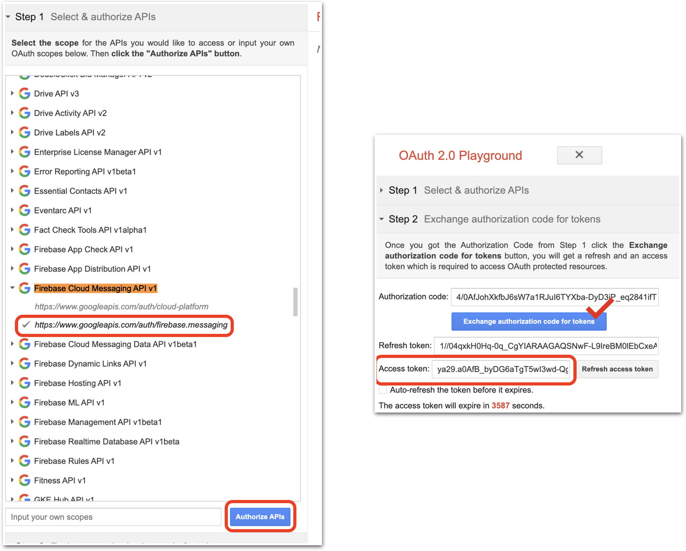
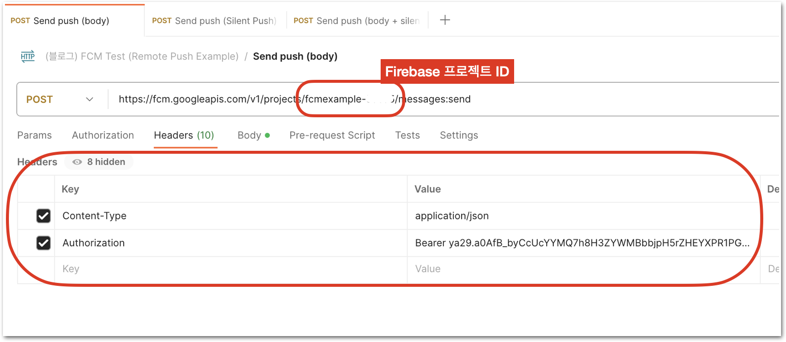
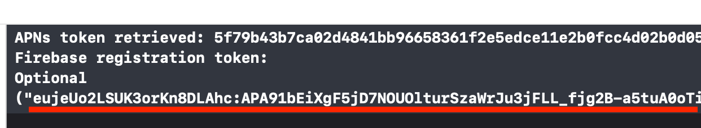
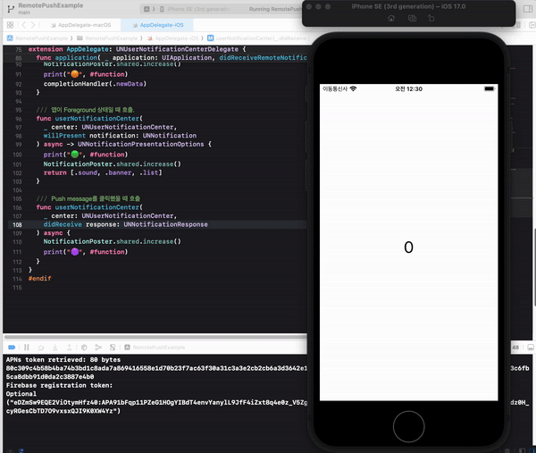
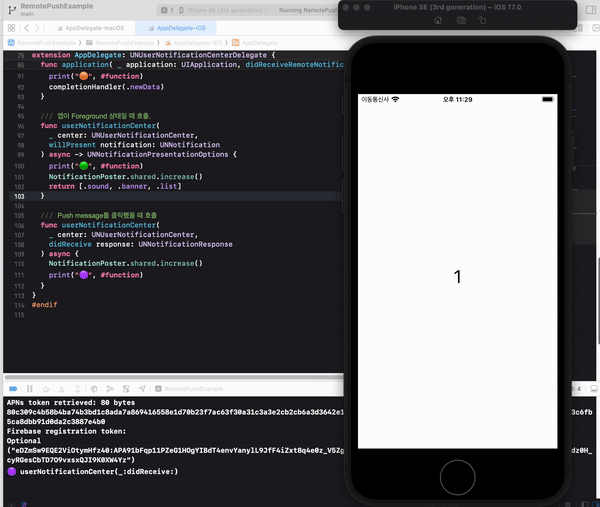

# Remote Push Notification(with FCM) 예제 프로젝트

이 프로젝트는 iOS 또는 macOS Application에 **Remote Push Notification** 기능을 구현하기 위해 필요한 정보들과 제약사항을 글로 정리하고, 이를 구현한 예제를 통해 해당 기능을 테스트 하는 방법까지 작성하기 위하여 제작되었음.

해당 프로젝트는 [Firebase Cloud Messaging](https://firebase.google.com/docs/cloud-messaging?hl=ko) (이하 FCM)을 기반으로 작성되었음.

## 환경

### 개발(테스트) 환경
- Xcode 15.0.1
- iOS 17.0
- macOS 14.0
- [FCM SDK 10.19.0](https://github.com/firebase/firebase-ios-sdk/releases/tag/10.19.0)

### 테스트 도구
- [OAuth 2.0 Playground](https://developers.google.com/oauthplayground/)
- [Postman](https://www.postman.com/)

## 프로젝트 설정

iOS, macOS Application을 FCM과 연동하기 위해서는 먼저 아래의 절차들을 거쳐야 한다.  
❗️ **원격 푸시는 테스트용이라 할지라도 애플 개발자 프로그램에 가입해야 한다.**

### Apple APNs Key(.p8) 생성

1. [Apple Developer 사이트](https://developer.apple.com/account) 접속
2. [인증서, 식별자 및 프로파일] > [키(영문)] 메뉴 진입
3. **Key (.p8) 발급 및 파일 다운로드**

> **다운받은 키 파일(.p8)은 잘 보관해야 한다. (다시 다운로드 할 수 없고, 분실했다면 다른 key를 다시 발급받아야 함.)**


### FCM 프로젝트 생성

1. [Firebase 사이트](https://firebase.google.com/?hl=ko) 접속
2. **[프로젝트 추가]**
   - [추가 방법 설명서](https://firebase.google.com/docs/ios/setup?hl=ko#create-firebase-project)

### 생성한 FCM 프로젝트에 iOS 앱 등록

만약 이 프로젝트를 그대로 자신의 환경에서 테스트 하려 한다면,  
**이 프로젝트 파일의 Bundle Identifier를 자신의 Firebase 프로젝트에 입력한 값으로 수정**해서 사용한다.


### `GoogleService-Info.plist` 파일 추가

위의 절차를 거치면 `GoogleService-Info.plist` 파일을 Firebase Console 페이지에서 다운받을 수 있다. 이 프로젝트를 Xcode로 Open한 다음, 다운받은 파일을 `Drag & Drop` (또는 [우클릭 > `Add Files to ...`]) 방식으로 프로젝트에 추가해준다.


### FCM 프로젝트 설정


### Capabilities 추가 설정
- `Background Modes - Remote Notifications` 활성화
- `Push Notifications` 추가
- `macOS`의 경우 `App Sandbox - Network - Incoming/Outcoming Connections` 를 활성화 하거나, `App Sandbox` 기능을 완전히 제거한다.


### `Info.plist` 설정

프로젝트의 `Info.plist` 파일에 `FirebaseAppDelegateProxyEnabled` 항목을 추가해준다. 타입은 **`Boolean`** 으로 지정해주고, 값은 **`NO`** 로 설정한다. 이 설정을 건너뛰면 release 스킴일 때 푸시를 받아볼 수 없다고 한다. (직접 테스트는 안해봤다.)

이 설정은 Firebase가 앱이 실행될 때 디바이스의 APNs 토큰을 생성, 등록하는 메서드를 스위즐링하는 옵션을 끄는 것이라고 한다. (이걸 왜 꺼야만 하는건지는 아직 잘 모르겠지만 우선 가이드를 따른다.)

> [Firebase 가이드 - Apple 플랫폼 클라이언트 설정](https://firebase.google.com/docs/cloud-messaging/ios/client?hl=ko)
> 
> **FCM SDK는 FCM 등록 토큰에 APN 토큰을 매핑**하고 다운스트림 메시지 콜백 처리 중에 애널리틱스 데이터를 캡처하는 등 두 **주요 영역에서 메서드를 재구성합니다.**
> 
> 재구성을 사용하지 않으려는 개발자는 앱의 `Info.plist` 파일에 `FirebaseAppDelegateProxyEnabled` 플래그를 추가하고 **NO(불리언 값)** 로 설정하여 재구성을 사용 중지할 수 있습니다. 이 가이드의 관련 영역에서는 메서드 재구성을 사용할 때와 그렇지 않을 때의 코드 예시를 모두 제공합니다.


#### ⚠️ 주의점

FCM의 SDK에 버그가 있다며, 해당 값을 `String`으로 설정해야 한다는 내용이 있다. (FCM 연동에 관한 절대 다수의 아티클들이 그렇게 말한다.)

하지만 나의 테스트 환경에서는, 오히려 `String`으로 설정하면 key 발급 시 에러가 발생하며 Xcode 콘솔에 다음과 같은 경고가 표시되는 것을 확인할 수 있었다.

```
FIRMessaging Remote Notifications proxy enabled, will swizzle remote notification receiver handlers. If you'd prefer to manually integrate Firebase Messaging, add "FirebaseAppDelegateProxyEnabled" to your Info.plist, and set it to NO. Follow the instructions at:
https://firebase.google.com/docs/cloud-messaging/ios/client#method_swizzling_in_firebase_messaging
to ensure proper integration.
```

FCM SDK가 고쳐진건지 어떻게 된건지는 모르겠지만 아무튼, **과거에는 String 으로 설정해야 했다면 지금은 아니다.** (적어도 내 테스트 환경에서는 그렇다.)

## 테스트 방법

### [OAuth 2.0 Playground](https://developers.google.com/oauthplayground/) - FCM 액세스 토큰 생성하기.

Firebase의 HTTP API가 **`HTTP v1`** 으로 업그레이드 되면서, OAuth2 보안 모델에 따른 수명이 짧은 (1시간) 액세스 토큰을 사용하도록 변경되었다고 한다. 자세한 설명은 [FCM - HTTP v1 API로 이전](https://firebase.google.com/docs/cloud-messaging/migrate-v1?hl=ko) 페이지 참조.

Google Developer 페이지에서는, 테스트를 위해 이 액세스 토큰을 생성해주는 솔루션인 [OAuth 2.0 Playground](https://developers.google.com/oauthplayground/)를 제공해주고 있다.

- [OAuth 2.0 Playground](https://developers.google.com/oauthplayground/) 페이지에 접속한 뒤, `Firebase Cloud Messaging API v1` 을 검색하고 선택한다.
- 좌측의 `Step 1` 리스트에서 https://www.googleapis.com/auth/firebase.messaging` 을 선택한 뒤, 하단의 **`Authorize APIs`** 버튼을 클릭한다.
- 구글 계정 인증을 진행한 뒤, 다시 돌아온 `Step 2` 화면의 **`Exchange authorization code for tokens`** 버튼을 클릭하면 **Access token** 발급이 완료된다.
  - 이 토큰의 수명은 1시간이므로, 테스트 도중에 토큰이 만료되면 `Refresh access token` 버튼을 클릭하여 갱신된 토큰을 사용한다.



### `Postman` 테스트 환경 구성하기

이제 메시지 발송 API를 요청하기만 하면, Push 메시지가 디바이스로 전달될 것이다.  
메시지 전송 테스트까지 Playground 페이지에서 해도 되지만, 메시지 전송 이력이 남지 않는 불편함이 있어서 나는 `Postman`을 사용했다.

- `Postman` 앱을 실행한 뒤, 메시지 템플릿을 생성하고 type을 **`POST`** 로 설정한다.
- 요청 URL을 다음과 같이 설정한다.
  - `https://fcm.googleapis.com/v1/projects/{Firebase 프로젝트 ID}/messages:send`
  - "Firebase 프로젝트 ID"는 각자 생성한 Firebase 프로젝트 페이지에 접속하여 [프로젝트 설정] 메뉴에서 확인할 수 있다.
- `Headers` 탭을 열고, 다음과 같이 key-value 값을 설정한다.
  - Content-type : application/json
  - Authorization : Bearer <생성한 Access token>



### FCM에 전송할 API 요청 메시지 작성하기.

이제, 클라이언트에게 보낼 메시지 내용을 작성할 차례이다.  
마지막으로 한 가지 더 확인해야 할 것이 있는데, 바로 **"어떤 클라이언트에게 메시지를 보낼 것인가"** 이다.

위에서 설명한대로, **각 클라이언트(디바이스)는 FCM 토큰을 발급받고 이를 저장**하고 있는다. (완전 영구적인 것은 아니라고 한다.)  
**메시지를 발송하는 쪽에서 이 클라이언트 토큰을 함께 보내줘야** FCM 서버가 메시지를 잘 전달할 것이다.

이 프로젝트를 열고 앱을 맨 처음 실행하면, Xcode 콘솔에 다음과 같이 메시지가 출력되는 것을 볼 수 있다.  
우리는 Optional로 감싸져 있는 Firebase token만 알면 된다.



푸시 메시지를 보내는 방법은 **크게 두 가지**가 있다.  
메시지의 제목과 내용, 그리고 선택적으로 푸시 알람 우측의 이미지를 포함시켜서 보내는 **일반적인 방식**과,  
사용자에게 메시지 노출을 하지 않고, 오직 이벤트만 수신하는 **사일런트 푸시(Silent push)** 방식이다.

#### ✉️ 일반 푸시 메시지 요청 예시

```json
{
    "message": {
        "token": "{클라이언트 FCM 토큰}",
        "notification": {
            "body": "Body of Your Notification in data",
            "title": "Title of Your Notification in data"
        }
    }
}
```

#### 🤐 사일런트(Silent) 푸시 요청 예시

```json
{
    "message": {
        "token": "{클라이언트 FCM 토큰}",
        "apns": {
            "payload": {
                "aps": {
                    "content-available": 1
                }
            }
        }
    }
}
```

#### ✉️ + 🤐 푸시 메시지를 함께 보내면서 사일런트 푸시로 호출하기

```json
{
    "message": {
        "token": "{클라이언트 FCM 토큰}",
        "apns": {
            "payload": {
                "aps": {
                    "content-available": 1
                }
            }
        },
        "notification": {
            "body": "Body of Your Notification in data",
            "title": "Title of Your Notification in data"
        }
    }
}
```

## 동작 예시

이 예시 프로젝트는 푸시 메시지를 수신하고 `UNUserNotificationCenter` 의 이벤트(메서드)가 동작할 때 마다 **화면에 표시된 숫자를 +1 시켜주는 아주 단순한 동작**을 수행한다.

### 📱 iOS

1. **`userNotificationCenter(_:didReceive:withCompletionHandler:)`** 메서드는 사용자가 **푸시 메시지를 터치했을 때 호출**된다.



2. **`userNotificationCenter(_:willPresent:withCompletionHandler:)`** 메서드는 **앱이 Foreground 상태일 때 메시지를 수신하면 호출**된다.

**이 메서드의 리턴값을 수정하면, 메시지를 보여주지 않게 변경할 수도 있다.**



3. **`application(_:didReceiveRemoteNotification:fetchCompletionHandler:)`** 메서드는 앱의 상태와 상관없이, 사일런트 푸시일 때만 호출된다.

사일런트 푸시는 요청 body에 `"content-available": 1` 옵션이 포함되어 있는 경우를 말한다.

> **시뮬레이터 환경에서는 사일런트 푸시를 수신할 수 없어서** 화면 녹화는 생략하였음.

### 💻 macOS

`macOS` 는 두 가지 특이사항이 있다.

1. **사일런트 타입이어도, 사일런트가 아니어도** **`application(_:didReceiveRemoteNotification:fetchCompletionHandler:)`** 메서드가 **무조건 호출된다.**

실험에 의한 결과이기에, 이렇게 동작하는 현상이 애플이 설계한대로 잘 작동한것인지 아니면 오히려 오동작인 것인지는 잘 모르겠다. 아무튼, iOS와는 다르게 **사일런트가 아니어도 `didReceiveRemoteNotification` 메서드가 매번 호출**된다.


2. **`userNotificationCenter(_:didReceive:withCompletionHandler:)`** 메서드는 iOS와 마찬가지로, Push 알림 메시지를 **클릭했을 때 호출**된다.

**영상 녹화 모드일때는 Push 메시지가 화면에 보이지 않기 때문에,** 아래의 gif 에서는 메시지를 클릭하는 모습은 보이지 않는 점을 참고.


1. **`userNotificationCenter(_:willPresent:withCompletionHandler:)`** 메서드의 호출 조건은 앱이 **포커스** 를 갖고있는가? 이다.

단순히 모니터에 앱이 보인다고 해서 호출되는것이 아니다. 따라서 `willPresent` 메서드를 테스트 해보려면, Postman으로 메시지를 전송하고 잽싸게 **앱을 마우스로 클릭** 하여서 포커스를 잡아줘야 메서드가 호출된다.

