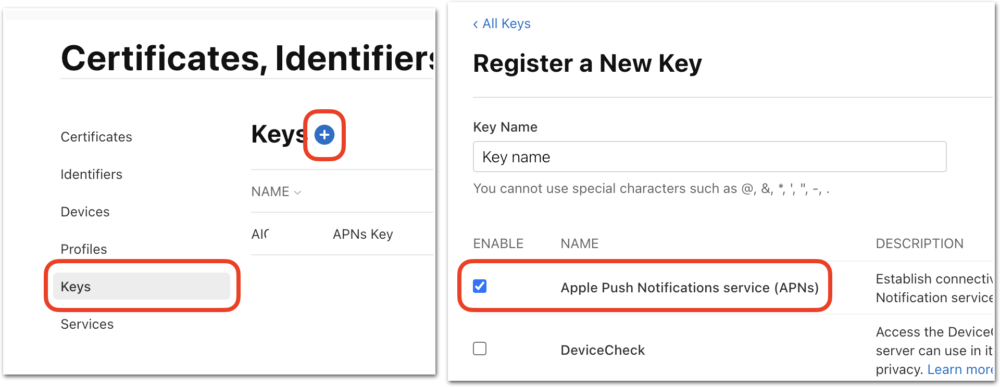
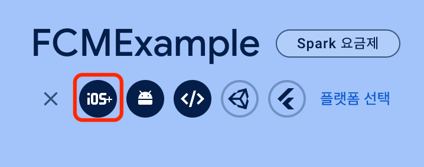
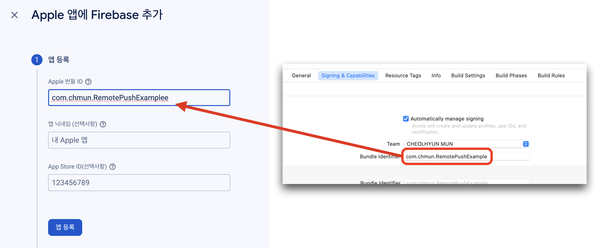
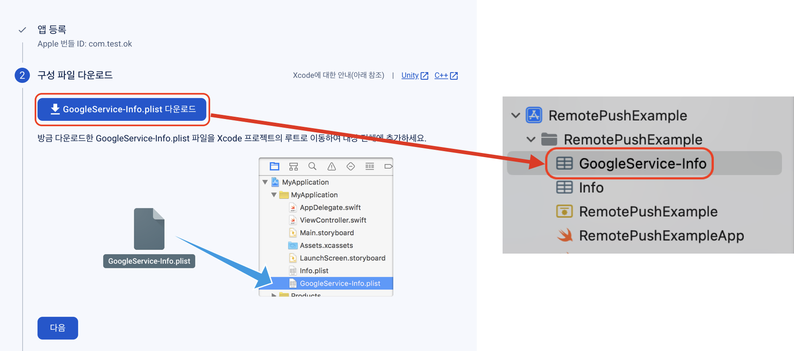
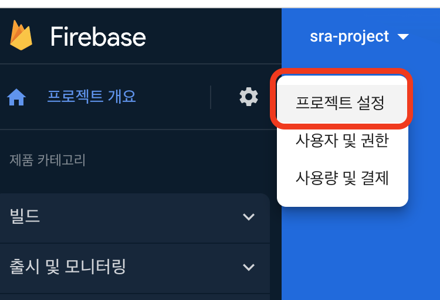
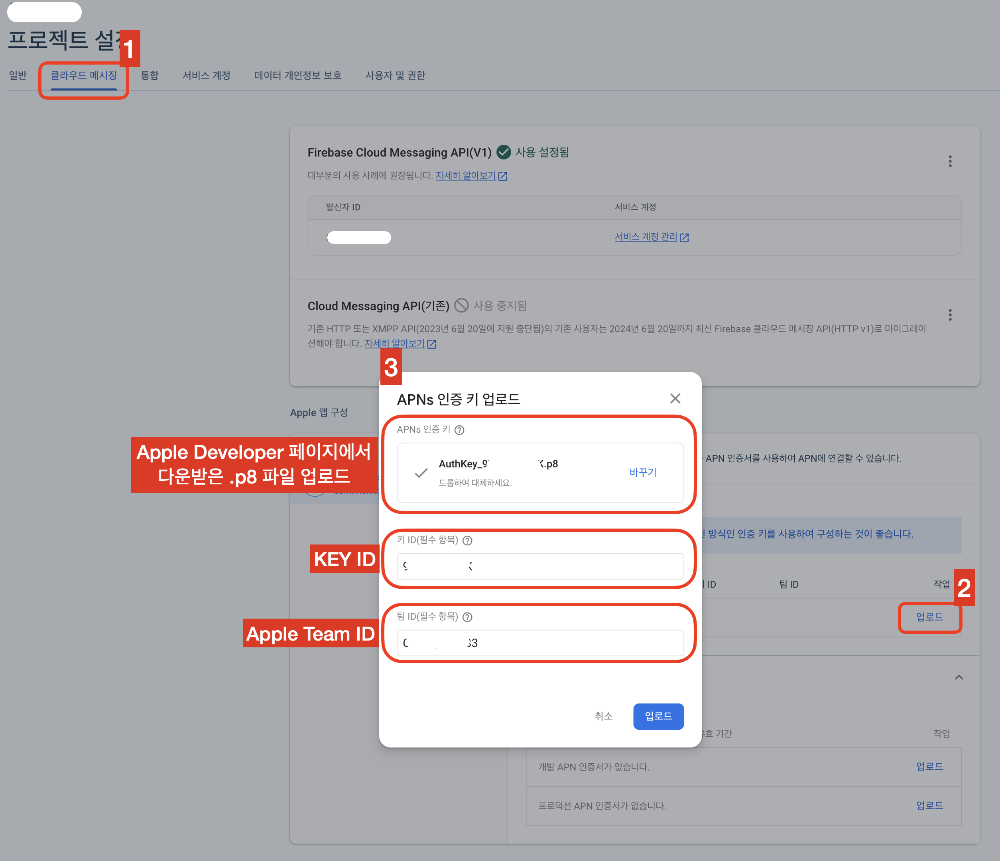
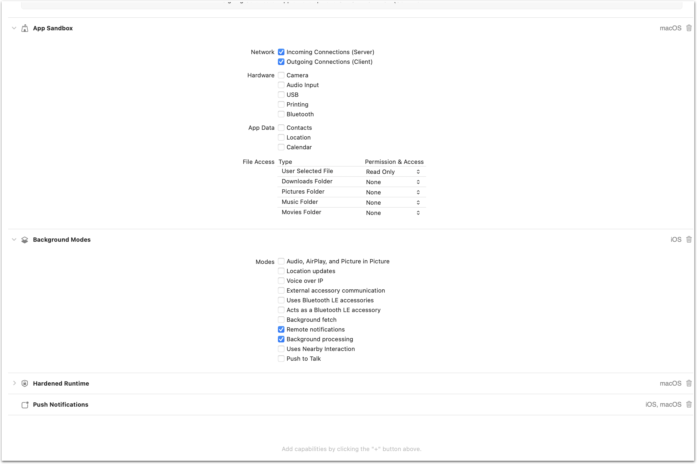
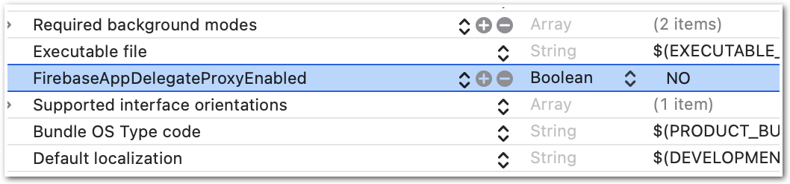

# Remote Push Notification(with FCM) 예제 프로젝트

## 개요

이 프로젝트는 iOS 또는 macOS Application에 **Remote Push Notification** 기능을 구현하기 위해 필요한 정보들과 제약사항을 글로 정리하고, 이를 구현한 예제를 통해 해당 기능을 테스트 하는 방법까지 작성하기 위하여 제작되었음.

해당 프로젝트는 [Firebase Cloud Messaging](https://firebase.google.com/docs/cloud-messaging?hl=ko) (이하 FCM)을 기반으로 작성되었음.

## 환경

### 개발(테스트) 환경
- Xcode 15.0.1
- iOS 17.0
- macOS 14.0
- [FCM SDK 10.19.0](https://github.com/firebase/firebase-ios-sdk/releases/tag/10.19.0)

### 테스트 도구
- [OAuth 2.0 Playground](https://developers.google.com/oauthplayground/)
- [Postman](https://www.postman.com/)

## 프로젝트 설정

iOS, macOS Application을 FCM과 연동하기 위해서는 먼저 아래의 절차들을 거쳐야 한다.
> **원격 푸시는 테스트용이라 할지라도 애플 개발자 프로그램에 가입해야 한다.**

### Apple APNs Key(.p8) 생성

1. [Apple Developer 사이트](https://developer.apple.com/account) 접속
2. [인증서, 식별자 및 프로파일] > [키(영문)] 메뉴 진입
3. **Key (.p8) 발급 및 파일 다운로드**



> 다운받은 키 파일(.p8)은 잘 보관해야 한다. (다시 다운로드 할 수 없고, 분실했다면 다른 key를 다시 발급받아야 함.)

### FCM 프로젝트 생성

1. [Firebase 사이트](https://firebase.google.com/?hl=ko) 접속
2. **[프로젝트 추가]**
   - [추가 방법 설명서](https://firebase.google.com/docs/ios/setup?hl=ko#create-firebase-project)

### 생성한 FCM 프로젝트에 iOS 앱 등록

만약 이 프로젝트를 그대로 자신의 환경에서 테스트 하려 한다면, **이 프로젝트 파일의 Bundle Identifier를 자신의 Firebase 프로젝트에 입력한 값으로 수정**해서 사용한다.





### `GoogleService-Info.plist` 파일 추가

위의 절차를 거치면 `GoogleService-Info.plist` 파일을 Firebase Console 페이지에서 다운받을 수 있다. 이 프로젝트를 Xcode로 Open한 다음, 다운받은 파일을 `Drag & Drop` (또는 [우클릭 > `Add Files to ...`]) 방식으로 프로젝트에 추가해준다.



### FCM 프로젝트 설정





### Capabilities 추가 설정
- `Background Modes - Remote Notifications` 활성화
- `Push Notifications` 추가
- `macOS`의 경우 `App Sandbox - Network - Incoming/Outcoming Connections` 를 활성화 하거나, `App Sandbox` 기능을 완전히 제거한다.



### `Info.plist` 설정

프로젝트의 `Info.plist` 파일에 `FirebaseAppDelegateProxyEnabled` 항목을 추가해준다. 타입은 **`Boolean`** 으로 지정해주고, 값은 **`NO`** 로 설정한다. 이 설정을 건너뛰면 release 스킴일 때 푸시를 받아볼 수 없다고 한다. (직접 테스트는 안해봤다.)

이 설정은 Firebase가 앱이 실행될 때 디바이스의 APNs 토큰을 생성, 등록하는 메서드를 스위즐링하는 옵션을 끄는 것이라고 한다. (이걸 왜 꺼야만 하는건지는 아직 잘 모르겠지만 우선 가이드를 따른다.)

> [Firebase 가이드 - Apple 플랫폼 클라이언트 설정](https://firebase.google.com/docs/cloud-messaging/ios/client?hl=ko)
> 
> **FCM SDK는 FCM 등록 토큰에 APN 토큰을 매핑**하고 다운스트림 메시지 콜백 처리 중에 애널리틱스 데이터를 캡처하는 등 두 **주요 영역에서 메서드를 재구성합니다.**
> 
> 재구성을 사용하지 않으려는 개발자는 앱의 `Info.plist` 파일에 `FirebaseAppDelegateProxyEnabled` 플래그를 추가하고 **NO(불리언 값)** 로 설정하여 재구성을 사용 중지할 수 있습니다. 이 가이드의 관련 영역에서는 메서드 재구성을 사용할 때와 그렇지 않을 때의 코드 예시를 모두 제공합니다.



#### ⚠️ 주의점

FCM의 SDK에 버그가 있다며, 해당 값을 `String`으로 설정해야 한다는 내용이 있다. (FCM 연동에 관한 절대 다수의 아티클들이 그렇게 말한다.)

하지만 나의 테스트 환경에서는, 오히려 `String`으로 설정하면 key 발급 시 에러가 발생하며 Xcode 콘솔에 다음과 같은 경고가 표시되는 것을 확인할 수 있었다.

```
FIRMessaging Remote Notifications proxy enabled, will swizzle remote notification receiver handlers. If you'd prefer to manually integrate Firebase Messaging, add "FirebaseAppDelegateProxyEnabled" to your Info.plist, and set it to NO. Follow the instructions at:
https://firebase.google.com/docs/cloud-messaging/ios/client#method_swizzling_in_firebase_messaging
to ensure proper integration.
```

FCM SDK가 고쳐진건지 어떻게 된건지는 모르겠지만 아무튼, **과거에는 String 으로 설정해야 했다면 지금은 아니다.** (적어도 내 테스트 환경에서는 그렇다.)

## 테스트 방법

- [OAuth 2.0 Playground](https://developers.google.com/oauthplayground/) 에서 1시간짜리 FCM 토큰 생성하기.
- FCM에 전송할 API 요청 메시지 작성하기.
  - 일반 푸시 요청 예시
  - 사일런트(Silent) 푸시 요청 예시
- Postman으로 테스트하기.

작성중..

## 동작 예시 (gif)

작성중..